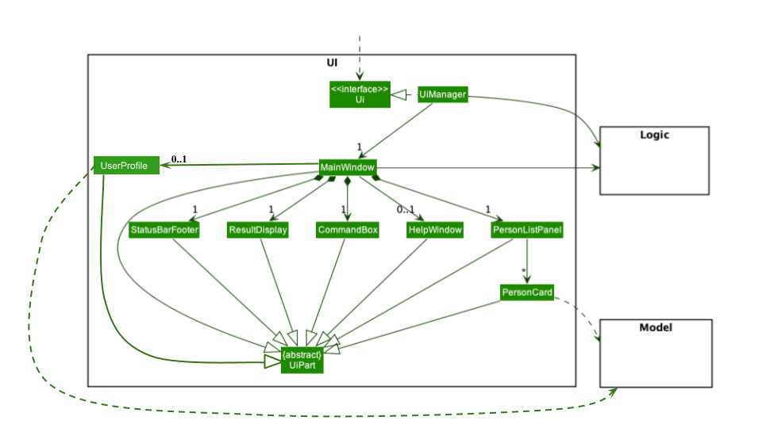
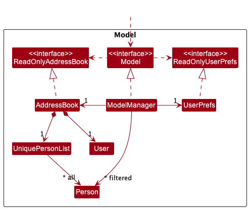
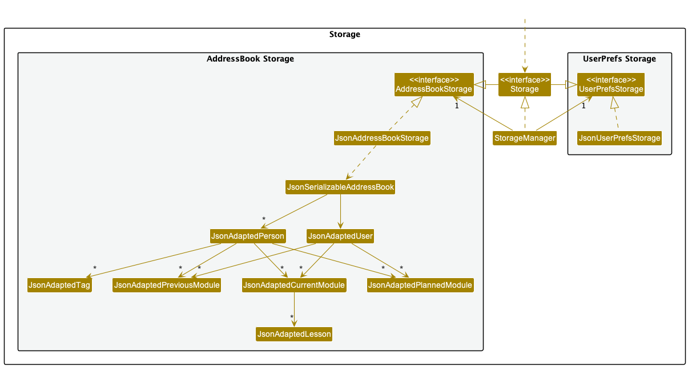
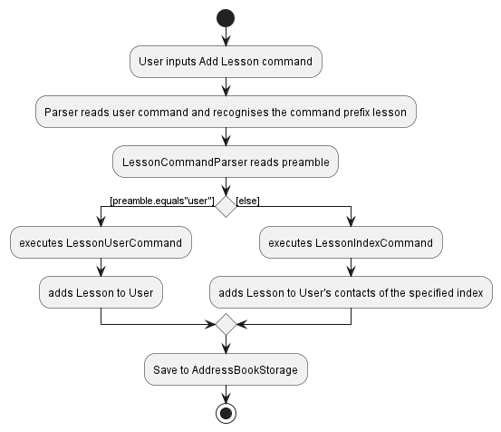
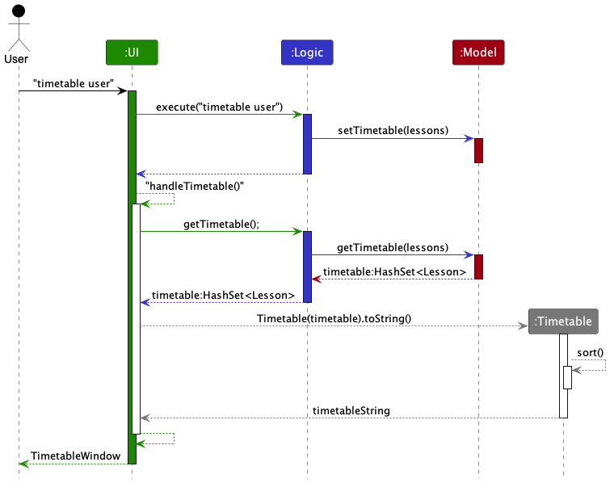
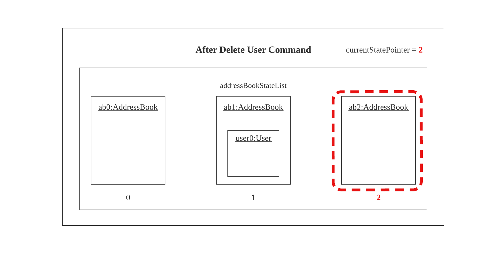
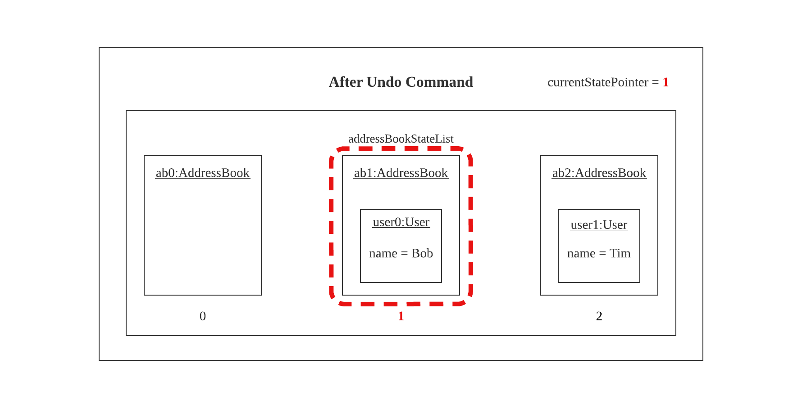

* Table of Contents
- [ConnectNUS Developer Guide](#connectnus-developer-guide)
- [Navigating the Developer Guide](#navigating-the-developer-guide)
- [Acknowledgements](#acknowledgements)
- [Setting up](#setting-up-getting-started)
- [Design](#design)
  - [Architecture](#architecture)
  - [UI Component](#ui-component)
  - [Logic Component](#logic-component)
  - [Model Component](#model-component)
  - [Storage Component](#Storage-Component)
  - [Common Classes](#common-classes)
- [Implementation](#implementation)
  - [Edit contact modules](#edit-contact-modules)
  - [Edit user modules](#edit-user-modules)
  - [Check modules left](#checking-modules-left)
  - [Refreshing to next semester](#refreshing-to-next-semester)
  - [Add lessons](#adding-lessons)
  - [View timetable](#viewing-timetable)
  - [Undo / Redo](#undo--redo)
  - [Filter contacts](#filter-contacts)
- [Documentation, logging, testing, configuration, dev-ops](#documentation-logging-testing-configuration-dev-ops)
- [Appendix: requirements](#appendix-requirements)
  - [Product scope](#product-scope)
  - [User stories](#user-stories)
  - [Use cases](#use-cases)
  - [Non-functional requirements](#non-functional-requirements)
  - [Glossary](#glossary)
- [Appendix: Instructions for manual testing](#appendix-instructions-for-manual-testing)

--------------------------------------------------------------------------------------------------------------------

## **ConnectNUS Developer Guide**

* {intro our app, value}

--------------------------------------------------------------------------------------------------------------------

## **Navigating the Developer Guide**

* {who will read, There is an explanation on how to use the developer guide (e.g. meaning of various formatting conventions, icons, colour codes) }

--------------------------------------------------------------------------------------------------------------------

## **Acknowledgements**

* {list here sources of all reused/adapted ideas, code, documentation, and third-party libraries -- include links to the original source as well}

--------------------------------------------------------------------------------------------------------------------

## **Setting up, getting started**

Refer to the guide [_Setting up and getting started_](SettingUp.md).

--------------------------------------------------------------------------------------------------------------------

## **Design**

:bulb: **Tip:** The `.puml` files used to create diagrams in this document can be found in the [diagrams](https://github.com/se-edu/addressbook-level3/tree/master/docs/diagrams/) folder. Refer to the [_PlantUML Tutorial_ at se-edu/guides](https://se-education.org/guides/tutorials/plantUml.html) to learn how to create and edit diagrams.

### Architecture

The ***Architecture Diagram*** given above explains the high-level design of the App.

Given below is a quick overview of main components and how they interact with each other.

**Main components of the architecture**

**`Main`** has two classes called [`Main`](https://github.com/se-edu/addressbook-level3/tree/master/src/main/java/seedu/address/Main.java) and [`MainApp`](https://github.com/se-edu/addressbook-level3/tree/master/src/main/java/seedu/address/MainApp.java). It is responsible for,
* At app launch: Initializes the components in the correct sequence, and connects them up with each other.
* At shut down: Shuts down the components and invokes cleanup methods where necessary.

[**`Commons`**](#common-classes) represents a collection of classes used by multiple other components.

The rest of the App consists of four components.

* [**`UI`**](#ui-component): The UI of the App.
* [**`Logic`**](#logic-component): The command executor.
* [**`Model`**](#model-component): Holds the data of the App in memory.
* [**`Storage`**](#storage-component): Reads data from, and writes data to, the hard disk.

**How the architecture components interact with each other**

The *Sequence Diagram* below shows how the components interact with each other for the scenario where the user issues the command `delete 1`.

Each of the four main components (also shown in the diagram above),

* defines its *API* in an `interface` with the same name as the Component.
* implements its functionality using a concrete `{Component Name}Manager` class (which follows the corresponding API `interface` mentioned in the previous point.

For example, the `Logic` component defines its API in the `Logic.java` interface and implements its functionality using the `LogicManager.java` class which follows the `Logic` interface. Other components interact with a given component through its interface rather than the concrete class (reason: to prevent outside component's being coupled to the implementation of a component), as illustrated in the (partial) class diagram below.

The sections below give more details of each component.

### UI component

The **API** of this component is specified in [`Ui.java`](https://github.com/AY2223S1-CS2103T-T14-4/tp/blob/master/src/main/java/seedu/address/ui/Ui.java)

The UI consists of a `MainWindow` that is made up of parts e.g.`CommandBox`, `ResultDisplay`, `PersonListPanel`, `StatusBarFooter`, `UserProfile` etc. All these, including the `MainWindow`, inherit from the abstract `UiPart` class which captures the commonalities between classes that represent parts of the visible GUI.

The `UI` component uses the JavaFx UI framework. The layout of these UI parts are defined in matching `.fxml` files that are in the `src/main/resources/view` folder. For example, the layout of the [`MainWindow`](https://github.com/AY2223S1-CS2103T-T14-4/tp/blob/master/src/main/java/seedu/address/ui/MainWindow.java) is specified in [`MainWindow.fxml`](https://github.com/AY2223S1-CS2103T-T14-4/tp/blob/master/src/main/resources/view/MainWindow.fxml)

The `UI` component,

* executes user commands using the `Logic` component.
* listens for changes to `Model` data so that the UI can be updated with the modified data.
* keeps a reference to the `Logic` component, because the `UI` relies on the `Logic` to execute commands.
* depends on some classes in the `Model` component, as it displays `Person` object residing in the `Model`.

### Logic component

**API** : [`Logic.java`](https://github.com/se-edu/addressbook-level3/tree/master/src/main/java/seedu/address/logic/Logic.java)

Here's a (partial) class diagram of the `Logic` component:

How the `Logic` component works:
1. When `Logic` is called upon to execute a command, it uses the `AddressBookParser` class to parse the user command.
1. This results in a `Command` object (more precisely, an object of one of its subclasses e.g., `AddCommand`) which is executed by the `LogicManager`.
1. The command can communicate with the `Model` when it is executed (e.g. to add a person).
1. The result of the command execution is encapsulated as a `CommandResult` object which is returned back from `Logic`.

The Sequence Diagram below illustrates the interactions within the `Logic` component for the `execute("delete 1")` API call.

:information_source: **Note:** The lifeline for `DeleteCommandParser` should end at the destroy marker (X) but due to a limitation of PlantUML, the lifeline reaches the end of diagram.

Here are the other classes in `Logic` (omitted from the class diagram above) that are used for parsing a user command:

How the parsing works:
* When called upon to parse a user command, the `AddressBookParser` class creates an `XYZCommandParser` (`XYZ` is a placeholder for the specific command name e.g., `AddCommandParser`) which uses the other classes shown above to parse the user command and create a `XYZCommand` object (e.g., `AddCommand`) which the `AddressBookParser` returns back as a `Command` object.
* All `XYZCommandParser` classes (e.g., `AddCommandParser`, `DeleteCommandParser`, ...) inherit from the `Parser` interface so that they can be treated similarly where possible e.g, during testing.

### Model component
**API** : [`Model.java`](https://github.com/se-edu/addressbook-level3/tree/master/src/main/java/seedu/address/model/Model.java)

The `Model` component,

* stores the address book data i.e., all `Person` objects (which are contained in a `UniquePersonList` object) as well as the `User` .
* stores the currently 'selected' `Person` objects (e.g., results of a search query) as a separate _filtered_ list which is exposed to outsiders as an unmodifiable `ObservableList<Person>` that can be 'observed' e.g. the UI can be bound to this list so that the UI automatically updates when the data in the list change.
* stores a `UserPref` object that represents the user’s preferences. This is exposed to the outside as a `ReadOnlyUserPref` objects.
* does not depend on any of the other three components (as the `Model` represents data entities of the domain, they should make sense on their own without depending on other components)

:information_source: **Note:** An alternative (arguably, a more OOP) model is given below. It has a `Tag` list in the `AddressBook`, which `Person` references. This allows `AddressBook` to only require one `Tag` object per unique tag, instead of each `Person` needing their own `Tag` objects. Similarly, there is a `CurrentModule`, `PlannedModule` and `PreviousModule` lists and each unique instance has its own object.  

### Storage component

**API** : [`Storage.java`](https://github.com/se-edu/addressbook-level3/tree/master/src/main/java/seedu/address/storage/Storage.java)

The `Storage` component,
* can save both address book data and user preference data in json format, and read them back into corresponding objects.
* inherits from both `AddressBookStorage` and `UserPrefStorage`, which means it can be treated as either one (if only the functionality of only one is needed).
* depends on some classes in the `Model` component (because the `Storage` component's job is to save/retrieve objects that belong to the `Model`)

### Common classes

Classes used by multiple components are in the `seedu.addressbook.commons` package.

--------------------------------------------------------------------------------------------------------------------

## **Implementation**

This section describes some noteworthy details on how certain features are implemented.

### Edit contact modules

#### Person Class
Each `Person` in the AddressBook is implemented in the following way:

All `Person` have a `Name`, `Email`, `Address` and `Phone` and a set of `Tag`, `CurrentModule`, `PreviousModule`, `PlannedModule` and `Lesson`.
`Person`s can have a `Github` URL to their profile added, and as many `Tags`, `Modules` and `Lessons` as desired.

#### User Class

`User` Class is implemented the same way.

`User` has a `Name`, `Email`, `Address` and `Phone` and a set of `CurrentModule`, `PreviousModule`, `PlannedModule`, and `Lesson`.
`User` can have a `Github` URL to their profile added, and as many `Modules` and `Lessons` as desired.

#### Module class
`CurrentModule`, `PlannedModule`, and `PreviousModule` implement the `Module` interface.

All implementations of `Module`s have a name.

#### Design considerations

why we chose to have planned, curr and prev mods as own classes or wtv

### Edit user modules

Similar to edit contact modules blah blah... user implemented same way as person... module class same... diff command

#### Design considerations of editing user modules

use same parser as contacts or wtv for space since same function

### Checking modules left

#### Design considerations

only AY2021/22 enrolment bc we selfish blah blah...

### Refreshing to next semester

sequence diagram or sth

#### Design considerations

no clue lmao laura u do but if rly nth j remove the design considerations header and from the toc also

### Adding lessons
ConnectNUS has a feature that allows you to add lessons to your profile as well as any persons stored in the contact list,
so that it is easy to keep track of yours and your friend's schedules.

The command has the prefix `lesson` and has the parameters
`user / INDEX (must be a positive integer) [l/TYPE] [m/MODULE] [d/DAY] [start/START TIME] [end/END TIME]`

Given below are some examples of a user command to add a `Lesson`
1. Example 1 : Command to add a `Tutorial` for the module CS2103T that starts at 12pm and ends at 1pm every Thursday to the `User`
- `lesson user l/tut m/CS2103T d/4 start/12:00 end/13:00`

2. Example 2 : Command to add a `Lab` for the module CS2100 that starts at 4pm and ends at 5pm every Wednesday to the first contact.
- `lesson 1 l/lab m/cs2100 d/3 start/16:00 end/17:00`

3. Example 3 : Command to add a `Lecture` for the module CS2109S that starts at 10am and ends at 12pm every Friday to the fifth contact
- `lesson 5 l/lec m/cs2109s d/5 start/10:00 end/12:00`

#### Lesson class
In NUS School of Computing, every module generally has lab, lecture, recitation and tutorial slots.

We implemented an abstract `Lesson` class and the classes `Lab`, `Lecture`, `Recitation` and `Tutorial` that inherits from it.
Each of the class types have the class fields, `type`, `module`, `day`, `startTime`, and `endTime`.

The following class diagram illustrates the class diagram of the `Lesson` class and subclasses.

Each `Lesson` has a `moduleName:String`, `day:int` (between 1-7 inclusive, where 1 is Monday and 7 is Sunday),
`type:String` (where type is tut / rec / lab / lec), `start:LocalTime` and `end:LocalTime` to in HH:mm format.

#### Implementation flow

Given below is a sequence diagram to illustrate how the timetable mechanism behaves after the user attempts to add a tutorial.

Given below is an activity diagram to illustrate the behaviour of adding a Lesson within `Logic`.

#### Design considerations
**Aspect 1: How to implement the `Lesson` Class:**

* **Alternative 1 (current choice):** No dependency on `CurrentModule` i.e. moduleName is a `String`.
  * Pros:
    * Faster as there is no need to check through set of `CurrentModule`s before adding lesson.
    * More flexible as user is able to add lessons or activities that are not in the list of `CurrentModule` e.g. if contact is a TA.
  * Cons: Lack of input validation - user may input invalid lessons that he/she is not taking.

* **Alternative 2:** Dependency on `CurrentModule` i.e. moduleName is a `CurrentModule`.
  * Pros: Input validation - user can only input lessons for modules being taken.
  * Cons:
    * Slower due to need to check if `Lesson`'s module is in the list of `CurrentModule`s every time a `Lesson` is added.
    * Unable to accommodate alternative activities being added in the timetable.

* **Decision:** Alternative 1 as speed is important. There are a lot of lessons are expected to be added, since there is about 15 lessons a week per person,
that has to be multiplied by the number of contacts in ConnectNUS.

**Aspect 2: How to implement the day in `Lesson` Class:**

* **Alternative 1 (current choice):** Day as `int` between 1 and 7.
  * Pros: Quick sorting of lessons by day as operations on primitives like `int` is very fast.
  * Cons: Unintuitive for a user to consider day as an integer between 1 and 7.

* **Alternative 2:** Day as `String`.
  * Pros: Easy conversion to String to display.
  * Cons: Difficult to sort lessons by day.

* **Alternative 3:** Day as `DayOfWeek`.
  * Pros:
    * Quick to sort due to numeric value of each `DayOfWeek`.
    * Has function to convert to `String` value of day.
    * Safety: validates input to be only within the week.
  * Cons:
    * Slower sorting as `DayOfWeek` has to be converted to `int` to sort.
    * Does not address issue of unintuitive input for day in command.

* **Decision:** Alternative 1 as speed is important as mentioned in Aspect 1.

**Aspect 3: Data Structure to store all `Lesson`s:**

* **Alternative 1 (current choice):** `Hashset`.
  * Pros: Very fast adding of lessons, with removal of duplicates.
  * Cons: Slow sorting due to need to convert to list before sorting.

* **Alternative 2:** `List`.
  * Pros: Easy sorting due to included function.
  * Cons: No removal of duplicates

* **Decision:** Alternative 1 for fewer bugs due to duplicates that may fall through our checks. As sorting is only done
during `timetable` commands which will be called significantly fewer times than `lesson` commands, speed of sorting is not
as significant of an issue.

### Viewing timetable
ConnectNUS gives you the ability to view not only your own timetable, but that of your contacts as well, after `Lesson`s
have been added to your profile and their contact. This makes deconflicting schedules significantly faster and meetings can
be arranged easily.

The command has the prefix `timetable` and has the parameters
`user / INDEX (must be a positive integer)`

When the user executes the timetable command, a window will pop up which will display the timetable of the user or the specified index in the user's contacts, similar to the window shown below.

The timetable will display the lists of all lessons added to the user or user's contacts of the specified index in
chronological order.

Given below are some examples of a user command to show a `Timetable`.
1. Example 1 : Command to show the `User`'s timetable
- `timetable user`

2. Example 2 : Command to show the timetable of the user's first contact.
- `timetable 1`

3. Example 3 : Command to show the timetable of the user's tenth contact,
- `timetable 10`

### Implementation flow

Given below is a sequence diagram to illustrate how the timetable is displayed after the user attempts to show his/her
timetable.

`ModelManager`, which implements the `Model` class, stores an attribute `timetable`, which is a `HashSet` of `Lesson`s
that is being shown in the Timetable Window.

Before `UI` shows the `TimetableWindow` to the user, the `timetable:HashSet` is obtained from `Logic` and `Model` and then
sorted and converted to `String` which is displayed in the `TimetableWindow` which is now made visible.

#### Design considerations

**Aspect: How to implement the timetable feature:**

* **Alternative 1:** Displaying in the main window at all times.
  * Pros: User does not have to run a command to see his/her and his/her contact's timetable.
  * Cons: User may have to scroll if there is insufficient space to see the full timetable.

* **Alternative 2:** User runs a command to display his/her and his/her contact's timetable which creates a new window.
  * Pros: User will have a larger space to see the timetable.
  * Cons: We must ensure the implementation of the additional commands are correct and the UI displays correctly.
* **Decision:** Since we expect the timetable feature to not be used often (only when arranging meetings), we chose alternative 1
to reduce the clutter on the main window.

Possible Extensions:

1. Adding a `Link` field to allow Users to keep track of important links such as Coursemology, Microsoft Teams, Zoom
   lecture and project documents (ie. Google Docs) for each module to increase accessibility and convenience since there
   are many links to keep track off.

2. Allow User to sort his/her classes from all modules in chronological order or by modules depending on the User's
   preference to view his/her timetable.

3. Improving the GUI of the `Timetable` pop-up window for more visually pleasing user experience.

### Undo / redo

#### Proposed Implementation

The proposed undo/redo mechanism is facilitated by `VersionedAddressBook`. It extends `AddressBook` with an undo/redo history, stored internally as an `addressBookStateList` and `currentStatePointer`. Additionally, it implements the following operations:

* `VersionedAddressBook#commit()` — Saves the current address book state in its history.
* `VersionedAddressBook#undo()` — Restores the previous address book state from its history.
* `VersionedAddressBook#redo()` — Restores a previously undone address book state from its history.

These operations are exposed in the `Model` interface as `Model#commitAddressBook()`, `Model#undoAddressBook()` and `Model#redoAddressBook()` respectively.

Given below is an example usage scenario and how the undo/redo mechanism behaves at each step.

Step 1. The user launches the application for the first time. The `VersionedAddressBook` will be initialized with the initial address book state, and the `currentStatePointer` pointing to that single address book state.

Step 2. The user executes `delete 5` command to delete the 5th person in the address book. The `delete` command calls `Model#commitAddressBook()`, causing the modified state of the address book after the `delete 5` command executes to be saved in the `addressBookStateList`, and the `currentStatePointer` is shifted to the newly inserted address book state.

Step 3. The user executes `add n/David …​` to add a new person. The `add` command also calls `Model#commitAddressBook()`, causing another modified address book state to be saved into the `addressBookStateList`.

:information_source: **Note:** If a command fails its execution, it will not call `Model#commitAddressBook()`, so the address book state will not be saved into the `addressBookStateList`.

Step 4. The user now decides that adding the person was a mistake, and decides to undo that action by executing the `undo` command. The `undo` command will call `Model#undoAddressBook()`, which will shift the `currentStatePointer` once to the left, pointing it to the previous address book state, and restores the address book to that state.

:information_source: **Note:** If the `currentStatePointer` is at index 0, pointing to the initial AddressBook state, then there are no previous AddressBook states to restore. The `undo` command uses `Model#canUndoAddressBook()` to check if this is the case. If so, it will return an error to the user rather
than attempting to perform the undo.

The following sequence diagram shows how the undo operation works:

:information_source: **Note:** The lifeline for `UndoCommand` should end at the destroy marker (X) but due to a limitation of PlantUML, the lifeline reaches the end of diagram.

The `redo` command does the opposite — it calls `Model#redoAddressBook()`, which shifts the `currentStatePointer` once to the right, pointing to the previously undone state, and restores the address book to that state.

:information_source: **Note:** If the `currentStatePointer` is at index `addressBookStateList.size() - 1`, pointing to the latest address book state, then there are no undone AddressBook states to restore. The `redo` command uses `Model#canRedoAddressBook()` to check if this is the case. If so, it will return an error to the user rather than attempting to perform the redo.

Step 5. The user then decides to execute the command `list`. Commands that do not modify the address book, such as `list`, will usually not call `Model#commitAddressBook()`, `Model#undoAddressBook()` or `Model#redoAddressBook()`. Thus, the `addressBookStateList` remains unchanged.

Step 6. The user executes `clear`, which calls `Model#commitAddressBook()`. Since the `currentStatePointer` is not pointing at the end of the `addressBookStateList`, all address book states after the `currentStatePointer` will be purged. Reason: It no longer makes sense to redo the `add n/David …​` command. This is the behavior that most modern desktop applications follow.

The following activity diagram summarizes what happens when a user executes a new command:

Given below are the proposed Classes to implement:

* `VersionedAddressBook`
  * Extends `AddressBook` with an Undo/Redo history
  * Uses `addressBookStateList` (List of `AddressBook`s) and `currentStatePointer` (int Index of current `AddressBook` state)
  * `VersionedAddressBook#commit()`
    * Adds current `AddressBook` into `addressBookStateList`
    * Called after each change in `AddressBook` state
  * `VersionedAddressBook#undo()`
    * Calls `Model#canUndoAddressBook()` to check if there is a previous state
    * Shifts `currentStatePointer` back by one
    * Called after user inputs `undo` command
  * `VersionedAddressBook#redo()`
    * Calls `Model#canRedoAddressBook()` to check if there is a next state
    * Shifts `currentStatePointer` forward by one
    * Called after user inputs `redo` command

Given below are the proposed Methods to implement:
* `Model`
  * `Model#canUndoAddressBook()` - Checks if there is a previous `AddressBook` state
  * `Model#canRedoAddressBook()` - Checks if there is a forward `AddressBook` state
  * `Model#undoAddressBook()` - Changes the current Model to read from the previous `AddressBook` state
  * `Model#redoAddressBook()` - Changes the current Model to read from the next `AddressBook` state
  * `Model#commitAddressBook()` - Saves current `AddressBook` state into `addressBookStateList`

### \[Proposed\] Filter feature

#### Proposed Implementation

The proposed feature enables users to filter contacts by tags or modules. It is facilitated by `Command`, with the PersonCards being sorted according to tags instead of the order in which they were added to the app. This will be stored as an `ObservableList<Person>`. Additionally, it implements the following operations:

* `FilterByTagCommand#execute(Model model)` — Filters the `FilteredPersonList` according to tag.
* `FilterByCurrModCommand#execute(Model model)` — Filters the `FilteredPersonList` according to Current Modules.
* `FilterByPrevModCommand#execute(Model model)` — Filters the `FilteredPersonList` according to Previous Modules.
* `FilterByPlanModCommand#execute(Model model)` — Filters the `FilteredPersonList` according to Planned Modules.

These operations are exposed in the Model interface as `Model#updateFilteredPersonList`.

Given below is an example of the usage scenario and how the filtering mechanism behaves at each step.

Step 1. The User wants to filter their contacts according to tag. The `FilterByTagCommand#execute()` will update `Model#filteredPersons` with `Model#updateFilteredPersonList(Predicate<Person> predicate)`.

Step 2. The `PersonListPanel` Ui will then only display `PersonCard`s of contacts that have the tag specified by the User.

The following activity diagram summarizes what happens when a user executes a filterByTag command:

Reason for implementation: All filter methods could have been implemented as one class instead of multiple subclasses. However as the different filtering specifications would have to access different classes to filter the contact list, each filter command has been abstracted out as a different class.

#### Design considerations:

**Aspect: How undo & redo executes:**

* **Alternative 1 (current choice):** Saves the entire address book.
  * Pros: Easy to implement.
  * Cons: May have performance issues in terms of memory usage.

* **Alternative 2:** Individual command knows how to undo/redo by
  itself.
  * Pros: Will use less memory (e.g. for `delete`, just save the person being deleted).
  * Cons: We must ensure that the implementation of each individual command are correct.

### Filter contacts

#### Proposed Implementation

The proposed feature enables the user to move the CurrentModules in both the User and their contacts into PreviousModules. It is facilitated by `ShiftCommand`, where each `CurrentModule` in User's and Peron's Set<CurrentModule> will be deleted and changed into a `PreviousModule` and added into the User and each Person's `Set<PreviousModule>`. Additionally, it implemented the following operations:

* `Person#updatePrevMods` — Adds the `Modules` in `Set<CurrentModule>` into `Set<PreviousModule>`.
* `User#updatePrevMods` — Adds the `Modules` in `Set<CurrentModule>` into `Set<PreviousModule>`.

These operations are exposed in the Model interface as `Model#getPerson` and `Model#getUser` respectively.

Given below is an example of the usage scenario and how the User's PreviousModule's are updated.

Step 1. The User wants to update his ConnnectNUS app details as a new AY has started. He inputs the `shift` command.

Step 2. The LogicManager will parse the User's input and execute a `NextSemCommand`.

Step 3. When `NextSemCommand` is called, it will call on `Person#updatePrevMods` and `User#updatePrevMods`, updating both the User and all the Person's in the User's contact list.

Step 4. The changes will be reflected in the PersonCard and UserProfile Uis.

The following activity diagram summarizes what happens when a user executes a shift command:

--------------------------------------------------------------------------------------------------------------------

## **Documentation, logging, testing, configuration, dev-ops**

* [Documentation guide](Documentation.md)
* [Testing guide](Testing.md)
* [Logging guide](Logging.md)
* [Configuration guide](Configuration.md)
* [DevOps guide](DevOps.md)

--------------------------------------------------------------------------------------------------------------------

## **Appendix: Requirements**

### Product scope

**Target user profile**:

NUS CS Students who wish to keep track of their friends to work with

**Value proposition**:

We help NUS CS Students to have a collection of fellow NUS CS Students to find people to collaborate with for CS work and projects

### User stories

Priorities: High (must have) - `* * *`, Medium (nice to have) - `* *`, Low (unlikely to have) - `*`

| Priority | As a …​                                   | I want to …​                                     | So that I can…​                                                                         |
|----------|-------------------------------------------|--------------------------------------------------|-----------------------------------------------------------------------------------------|
| `* * *`  | new user                                  | see usage instructions                           | refer to instructions when I forget how to use the App                                  |
| `* * *`  | user                                      | save my own profile                              | keep track of my own information                                                        |
| `* * *`  | user                                      | edit my own profile                              | update my own information when there are changes                                        |
| `* * *`  | user                                      | delete my own profile                            | remove my information in case of any data breach                                        |
| `* * *`  | user                                      | save a new contact                               | contact them if i wish to collaborate with them                                         |
| `* * *`  | user                                      | edit my friends' contact information             | change and update the contacts in my friend's list to make sure it is always up to date |
| `* * *`  | user                                      | delete a person                                  | remove entries that I no longer need                                                    |
| `* * *`  | user                                      | list out all my friend's contact/ info           | look through all my contacts at once                                                    |
| `* * *`  | user                                      | keep track of the modules I have taken           | plan my modules easily                                                                  |
| `* * *`  | user                                      | keep track of my friend's current modules        | so that i know which modules i can collaborate with them for                            |
| `* * *`  | user                                      | keep track of my friend's previous modules       | consult my friends on those modules, if i am currently taking them                      |
| `* * *`  | user                                      | see what modules my friends are planning to take | plan my modules together with them                                                      |
| `* *`    | user                                      | view my timetable                                | be clear on what classes are coming up                                                  |
| `* *`    | user                                      | check what core modules I have left to clear     | plan my following semesters better to accommodate these modules                         |
| `*`      | user                                      | view my own exam schedule                        | be clear on which exams are coming up                                               |

*{More to be added}*

### Use cases

**System: ConnectNUS**

**Use case: UC1 - See usage instructions**

**Actor: CS Students**

**MSS**

1. CS Student chooses to see usage instructions.
2. ConnectNUS displays the usage instructions.
3. Use case ends.
4. Use case ends.

**System: ConnectNUS**

**Use case: UC2 - Save my user profile**

**Actor: CS Students**

**MSS**

1. CS Student chooses to save their own profile.
2. ConnectNUS requests for details of their profile to be saved.
3. CS Student enters the requested details.
4. ConnectNUS saves the user profile and updates the data file.
5. Use case ends.

**Extensions**

* 1a. ConnectNUS detects another user profile that has already been saved

  * 1a1. ConnectNUS informs the user that there already is a user profile saved.
  * Use case ends.

* 3a. ConnectNUS detects an error in the entered data

    * 3a1. ConnectNUS requests for the correct data.
    * 3a2. CS Student enters new data.
    * Steps 3a-3b are repeated until the data entered are correct.
      Use case resumes at step 4.

**System: ConnectNUS**

**Use case: UC3 - Edit user profile**

**Actor: CS Students**

**MSS**

1. CS Student chooses to edit their own profile.
2. ConnectNUS requests for details of their profile to be edited.
3. CS Student enters the requested details.
4. ConnectNUS saves the edited user profile and updates the data file.
5. Use case ends.

**Extensions**

* 1a. ConnectNUS does not detect any user profile to edit

    * 1a1. ConnectNUS informs user that there is no user profile to edit.
    * Use case ends.

* 3a. ConnectNUS detects an error in the entered data

    * 3a1. ConnectNUS requests for the correct data.
    * 3a2. CS Student enters new data.
    * Steps 3a-3b are repeated until the data entered are correct.
      Use case resumes at step 4.

**System: ConnectNUS**

**Use case: UC4 - Delete user profile**

**Actor: CS Students**

**MSS**

1. CS Student chooses to delete their own profile.
2. ConnectNUS deletes the user profile and updates the data file.
3. Use case ends.

**Extensions**

* 1a. ConnectNUS does not detect any user profile to delete

    * 1a1. ConnectNUS informs user that there is no user profile to delete.
    * Use case ends.

* 1b. ConnectNUS detects an error in the command format.
    * 1b1. ConnectNUS requests for the correct format.
    * User enters a new command in the correct format.
      Steps 1a1-1a2 are repeated until the data entered are correct.
      Use case resumes at step 2.

**System: ConnectNUS**

**Use case: UC5 - Save a new contact**

**Actor: CS Students**

**MSS**

1. CS Student chooses to save a new contact.
2. ConnectNUS requests for details of the contact to be saved.
3. CS Student enters the requested details.
4. ConnectNUS saves the contact and updates the data file.
5. Use case ends.

**Extensions**

* 3a. ConnectNUS detects an error in the entered data

    * 3a1. ConnectNUS requests for the correct data.
    * 3a2. CS Student enters new data.
    * Steps 3a-3b are repeated until the data entered are correct.
    Use case resumes at step 4.

**Use case: UC6 - Edit a contact**

**Actor: CS Students**

**MSS**

1. CS Student chooses to edit a specific index of contact.
2. ConnectNUS requests for details of the contact to be edited.
3. CS Student enters the requested details.
4. ConnectNUS saves the edited contact and updates the data file.
5. Use case ends.

**Extensions**

* 1a. ConnectNUS detects an error in the command format or invalid index.
    * 1a1. ConnectNUS requests for the correct format or index.
    * User enters a new command in the correct format or index.
      Steps 1a1-1a2 are repeated until the data entered are correct.
      Use case resumes at step 2.

* 3a. ConnectNUS detects an error in the entered data

    * 3a1. ConnectNUS requests for the correct data.
    * 3a2. CS Student enters new data.
    * Steps 3a-3b are repeated until the data entered are correct.
      Use case resumes at step 4.

**System: ConnectNUS**

**Use case: UC7 - Delete a contact**

**Actor: CS Students**

**MSS**

1. CS Student requests to delete a specific index of contact.
2. ConnectNUS deletes the contact and updates data file.
3. Use case ends.

**Extensions**

* 1a. ConnectNUS detects an error in the command format or invalid index.
    * 1a1. ConnectNUS requests for the correct format or index.
    * User enters a new command in the correct format or index.
      Steps 1a1-1a2 are repeated until the data entered are correct.
      Use case resumes at step 2.

**System: ConnectNUS**

**Use case: UC8 - List out all my friend’s contact/information**

**Actor: CS Students**

**MSS**

1. CS Student requests to list all contact information.
2. ConnectNUS shows a list of contacts based on the order that the contacts are added.
3. Use case ends.

**Extensions**

* 2a. The list is empty.
    Use case ends.

**System: ConnectNUS**

**Use case: UC9 - Keep track of modules taken by user**

**Actor: CS Students**

**MSS**

1. CS Student requests to list all modules.
2. ConnectNUS shows a list of modules the CS Student has taken.
3. Use case ends.

**Extensions**

* 2a. The list is empty.
  Use case ends.

**System: ConnectNUS**

**Use case: UC10 - Keep track of friend’s current modules**

**Actor: CS Students**

**MSS**

1. CS Student requests to list all modules of a specific index of contact.
2. ConnectNUS shows a list of modules the specified friend has taken.
3. Use case ends.

**Extensions**

* 1a. ConnectNUS detects an error in the command format.
    * 1a1. ConnectNUS requests for the correct format.
    * User enters a new command in the correct format.
      Steps 1a1-1a2 are repeated until the data entered are correct.
      Use case resumes at step 2.

* 2a. The list is empty.
      Use case ends.

**System: ConnectNUS**

**Use case: UC11 - Keep track of friend’s previous modules**

**Actor: CS Students**

**MSS**

1. User requests to list all previous modules of a specific index of contact.
2. ConnectNUS shows a list of modules the specified friend has taken previously.
3. Use case ends.

**Extensions**

* 1a. ConnectNUS detects an error in the command format.
    * 1a1. ConnectNUS requests for the correct format.
    * User enters a new command in the correct format.
      Steps 1a1-1a2 are repeated until the data entered are correct.
      Use case resumes at step 2.

* 2a. The list is empty.
  Use case ends.

**System: ConnectNUS**

**Use case: UC12 - Keep track of friend’s module plan**

**Actor: CS Students**

**MSS**

1. CS Student requests to list a friend’s module plan of a specific index of contact.
2. ConnectNUS shows a list of modules the specified friend has taken previously.
3. Use case ends.

**Extensions**

* 1a. ConnectNUS detects an error in the command format.
    * 1a1. ConnectNUS requests for the correct format.
    * User enters a new command in the correct format.
      Steps 1a1-1a2 are repeated until the data entered are correct.
      Use case resumes at step 2.

* 2a. The list is empty.
  Use case ends.

**System: ConnectNUS**

**Use case: UC13 - Show User's Timetable**

**Actor: CS Students**

**MSS**

1. CS Student requests to show own Timetable.
2. ConnectNUS shows the Timetable of CS Student's current modules.
3. Use case ends.

**Extensions**

* 1a. ConnectNUS detects an error in the command format.
    * 1a1. ConnectNUS requests for the correct format.
    * User enters a new command in the correct format.
      Steps 1a1-1a2 are repeated until the data entered are correct.
      Use case resumes at step 2.

* 1b. No user, or no current modules for user, or no lessons for current modules.
    * 1b1. ConnectNUS informs user of missing data.
    * Use case ends.

**System: ConnectNUS**

**Use case: UC14 - Show contact's Timetable**

**Actor: CS Students**

**MSS**

1. CS Student requests to show contact's Timetable.
2. ConnectNUS shows the Timetable of CS Student's contact's current modules.
3. Use case ends.

**Extensions**

* 1a. ConnectNUS detects an error in the command format or index out of bounds.
    * 1a1. ConnectNUS requests for the correct format or index.
    * User enters a new command in the correct format or index.
      Steps 1a1-1a2 are repeated until the data entered are correct.
      Use case resumes at step 2.

* 1b. No current modules for contact, or no lessons for current modules.
    * 1b1. ConnectNUS informs user of missing data.
    * Use case ends.

**System: ConnectNUS**

**Use case: UC15 - Check core modules left that user must take**

**Actor: CS Students**

**MSS**

1. CS Student requests to check modules left.
2. ConnectNUS shows what core modules the user has yet to take.
3. Use case ends.

**Extensions**

* 1a. ConnectNUS detects an error in the command format.
    * 1a1. ConnectNUS requests for the correct format.
    * User enters a new command in the correct format.
      Steps 1a1-1a2 are repeated until the data entered are correct.
      Use case resumes at step 2.

* 1b. No user, or no current and previous modules for user.
    * 1b1. ConnectNUS informs user of missing data.
    * Use case ends.

*{More to be added}*

### Non-Functional Requirements

1. Should work on any _mainstream OS_ as long as it has Java `11` or above installed.
2. Should be able to hold up to 1000 persons without a noticeable sluggishness in performance for typical usage.
3. A user with above average typing speed for regular English text (i.e. not code, not system admin commands) should be able to accomplish most of the tasks faster using commands than using the mouse.
4. Should be a result of evolving AB3 code base.
5. Should be for a single user.
6. Should not use any Database Management System.
7. Should be platform independent and work on Windows, Linus and OS-X.
8. Should work without an installer and without approved third-party frameworks/libraries/services.
9. Should be able to package into a single JAR file.
10. JAR file size should not exceed 100MB and Documents should not exceed 15 MB per file.

*{More to be added}*

### Glossary

* **Mainstream OS**: Windows, Linux, Unix, OS-X
* **Private contact detail**: A contact detail that is not meant to be shared with others
* **PlantUML**: A tool for specifying various diagrams in a textual form

--------------------------------------------------------------------------------------------------------------------

## **Appendix: Instructions for manual testing**

Given below are instructions to test the app manually.

:information_source: **Note:** These instructions only provide a starting point for testers to work on;
testers are expected to do more *exploratory* testing.

### Launch and shutdown

1. Initial launch

   1. Download the jar file and copy into an empty folder

   1. Double-click the jar file Expected: Shows the GUI with a set of sample contacts. The window size may not be optimum.

1. Saving window preferences

   1. Resize the window to an optimum size. Move the window to a different location. Close the window.

   1. Re-launch the app by double-clicking the jar file. 
       Expected: The most recent window size and location is retained.

1. _{ more test cases …​ }_

### Deleting a person

1. Deleting a person while all persons are being shown

   1. Prerequisites: List all persons using the `list` command. Multiple persons in the list.

   1. Test case: `delete 1` 
      Expected: First contact is deleted from the list. Details of the deleted contact shown in the status message. Timestamp in the status bar is updated.

   1. Test case: `delete 0` 
      Expected: No person is deleted. Error details shown in the status message. Status bar remains the same.

   1. Other incorrect delete commands to try: `delete`, `delete x`, `...` (where x is larger than the list size) 
      Expected: Similar to previous.

1. _{ more test cases …​ }_

### Saving data

1. Dealing with missing/corrupted data files

   1. _{explain how to simulate a missing/corrupted file, and the expected behavior}_

1. _{ more test cases …​ }_
